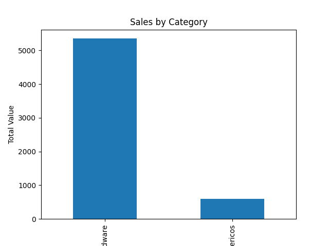

PT-BR
# Análise de Vendas com Python

Projeto simples de análise de dados utilizando Python e Pandas.

## Tecnologias
- Python
- Pandas
- Matplotlib

## Funcionalidades
- Leitura de arquivo CSV
- Análise de vendas
- Gráficos automáticos
- Insights de dados

## Como executar

```bash
python main.py

Criado com python para propositos de aprendizado e portfolio.



---

ENGLISH

# Sales Data Analysis with Python

This is a simple data analysis project built with Python to analyze sales data from a CSV file and generate insights and visualizations automatically.

## 📊 Project Overview

The goal of this project is to demonstrate basic data analysis skills using Python, including data loading, aggregation, and visualization.

## 🛠 Technologies Used

* Python
* Pandas
* Matplotlib

## ⚙️ Features

* Load sales data from a CSV file
* Calculate total sales
* Analyze sales by category
* Identify the most profitable product
* Generate and save charts automatically

## 📁 Project Structure

```
project-sales-analysis/
│
├── data/
│   └── vendas.csv
├── main.py
├── requirements.txt
└── README.md
```

## ▶️ How to Run

1. Clone the repository:

```
git clone <your-repository-link>
```

2. Navigate to the project folder:

```
cd project-sales-analysis
```

3. Create and activate a virtual environment:

```
python -m venv venv
venv\Scripts\activate
```

4. Install dependencies:

```
python -m pip install -r requirements.txt
```

5. Run the project:

```
python main.py
```

## 📈 Output

The program will:

* Display sales insights in the terminal
* Generate a bar chart showing sales by category
* Save the chart as `grafico_vendas.png`

## 🎯 Purpose

This project was created as a portfolio project to demonstrate foundational skills in Python and data analysis for internship opportunities.

---

## Example Output

Created with Python for learning and portfolio purposes.


